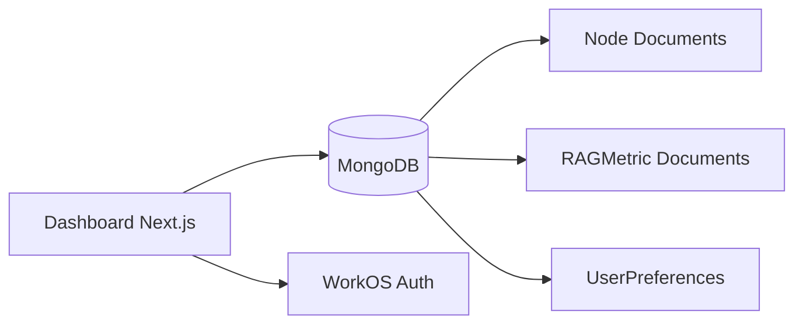
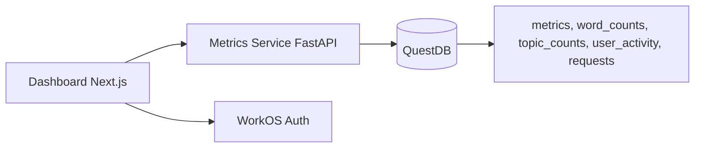
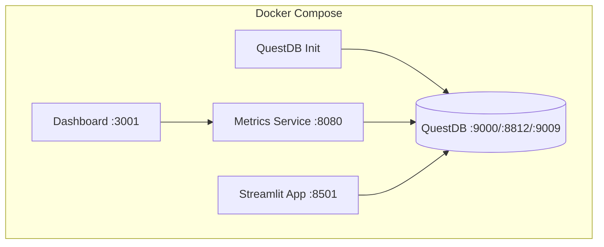

# Design Document: Dashboard Metrics Service Integration

## Overview

This design document describes the architectural migration of the dashboard from a MongoDB-based data layer to consuming data from the metrics_service REST API. The migration simplifies the architecture by removing multi-node support (since all data comes from a single local deployment) while preserving user authentication for tracking purposes.

### Key Changes

1. **Data Source Migration**: Replace MongoDB/Mongoose with HTTP calls to metrics_service
2. **Node Removal**: Remove all multi-node functionality (UI, API, models)
3. **Docker Integration**: Add dashboard service to the main docker-compose.yml
4. **Simplified Data Model**: Map new QuestDB schema to dashboard UI

## Architecture

### Current Architecture (Before)



### Target Architecture (After)



### Docker Compose Architecture



## Components and Interfaces

### 1. Metrics Service API Client

A new service layer to communicate with the metrics_service REST API.

```typescript
// dashboard/src/lib/metrics-api.ts
interface MetricsApiClient {
  getMeanMetric(params: {
    metric: string;
    userId?: string;
    userRole?: string;
    startDate?: string;
    endDate?: string;
  }): Promise<{ result: number }>;

  getTopSearchTerms(params: {
    k?: number;
    userId?: string;
    userRole?: string;
    startDate?: string;
    endDate?: string;
  }): Promise<{ result: Array<{ word: string; count: number }> }>;

  getMeanSessionLength(params: {
    userId?: string;
    userRole?: string;
    startDate?: string;
    endDate?: string;
  }): Promise<{ result: number }>;
}
```

### 2. Updated tRPC Metrics Router

The metrics router will proxy requests to the metrics_service instead of querying MongoDB.

```typescript
// dashboard/src/server/api/routers/metrics.ts
export const metricsRouter = createTRPCRouter({
  get: protectedProcedure
    .input(metricsQuerySchema)
    .query(async ({ ctx, input }) => {
      // Call metrics_service API instead of MongoDB
      const metricsApi = createMetricsApiClient();
      
      const [meanResponseTime, topSearchTerms, meanSessionLength] = await Promise.all([
        metricsApi.getMeanMetric({ metric: 'response_time', ...params }),
        metricsApi.getTopSearchTerms({ k: 10, ...params }),
        metricsApi.getMeanSessionLength(params),
      ]);
      
      // Transform to UI data structure
      return transformToUIMetrics(meanResponseTime, topSearchTerms, meanSessionLength);
    }),

  getStats: protectedProcedure
    .input(metricsQuerySchema)
    .query(async ({ ctx, input }) => {
      // Aggregate stats from metrics_service
    }),

  exportMetrics: protectedProcedure
    .input(metricsQuerySchema)
    .query(async ({ ctx, input }) => {
      // Export data from metrics_service
    }),
});
```

### 3. Simplified App Layout

Remove NodeSelector and admin-only navigation.

```typescript
// dashboard/src/app/_components/app-layout.tsx
function CompanyDisplay({ user }: { user: WorkOSUser | null }) {
  if (!user) return null;
  
  // Simply display user info, no node selection
  return (
    <div className="text-muted-foreground flex items-center gap-2 text-sm">
      <User className="h-4 w-4" />
      <span className="font-medium">{user.email}</span>
    </div>
  );
}
```

### 4. Environment Configuration

Update environment variables to include metrics_service URL.

```typescript
// dashboard/src/env.js
export const env = createEnv({
  server: {
    NODE_ENV: z.enum(["development", "test", "production"]),
    METRICS_SERVICE_URL: z.string().url(),
    WORKOS_API_KEY: z.string(),
    WORKOS_CLIENT_ID: z.string(),
    WORKOS_COOKIE_PASSWORD: z.string(),
  },
  // ... rest of config
});
```

## Data Models

### QuestDB Schema (Source)

```sql
-- metrics table
CREATE TABLE metrics (
    ts TIMESTAMP,
    user_id SYMBOL,
    user_role SYMBOL,
    tag SYMBOL,        -- metric identifier (e.g., 'response_time', 'token_count')
    value DOUBLE
) TIMESTAMP(ts) PARTITION BY DAY;

-- word_counts table (for search terms)
CREATE TABLE word_counts (
    ts TIMESTAMP,
    user_id SYMBOL,
    user_role SYMBOL,
    word SYMBOL
) TIMESTAMP(ts) PARTITION BY DAY;

-- user_activity table (for session tracking)
CREATE TABLE user_activity (
    ts TIMESTAMP,
    user_id SYMBOL,
    user_role SYMBOL
) TIMESTAMP(ts) PARTITION BY DAY;
```

### Dashboard UI Data Structure (Target)

```typescript
interface DashboardMetrics {
  usage_metrics: {
    processed_queries: { total: number; daily_average: number };
    session_duration: { average_minutes: number };
  };
  performance_metrics: {
    average_response_time_ms: number;
  };
  extra_analytics: {
    top_queries: string[];
    common_words: string[];
  };
  metadata: {
    updatedAt: string;
  };
}
```

### Data Transformation Mapping

| Metrics Service Endpoint | Dashboard Field |
|-------------------------|-----------------|
| `/mean_metric?metric=response_time` | `performance_metrics.average_response_time_ms` |
| `/mean_session_length` | `usage_metrics.session_duration.average_minutes` |
| `/top_search_terms` | `extra_analytics.common_words` |

## Correctness Properties

*A property is a characteristic or behavior that should hold true across all valid executions of a system-essentially, a formal statement about what the system should do. Properties serve as the bridge between human-readable specifications and machine-verifiable correctness guarantees.*

### Property 1: API Response Transformation Consistency

*For any* valid metrics_service response, transforming it to the dashboard UI structure and back should preserve all essential data values.

**Validates: Requirements 1.2**

### Property 2: Date Range Parameter Propagation

*For any* date range filter applied in the dashboard, the start_date and end_date parameters passed to the metrics_service API should match the user's selection in ISO format.

**Validates: Requirements 1.4**

### Property 3: Authentication Enforcement

*For any* request to a protected tRPC procedure, if the user context is null, the request should be rejected with an UNAUTHORIZED error.

**Validates: Requirements 4.1**

### Property 4: User Context Propagation

*For any* authenticated request to the metrics router, the user_id from the authentication context should be included in the metrics_service API call parameters.

**Validates: Requirements 4.2**

### Property 5: Metrics Display Accuracy

*For any* mean metric value returned by the metrics_service, the dashboard should display the same numeric value (within floating-point precision).

**Validates: Requirements 6.1**

### Property 6: Search Terms Display Completeness

*For any* list of top search terms returned by the metrics_service, all terms should appear in the dashboard's common_words display.

**Validates: Requirements 6.2**

### Property 7: Router Transformation Correctness

*For any* valid metrics_service API response, the tRPC router's get procedure should return a valid DashboardMetrics object with all required fields populated.

**Validates: Requirements 7.1**

### Property 8: Preferences Node Field Exclusion

*For any* user preferences object returned by the preferences router, the response should not contain a defaultNodeId field.

**Validates: Requirements 8.2**

## Error Handling

### API Communication Errors

```typescript
async function fetchFromMetricsService<T>(endpoint: string, params: Record<string, string>): Promise<T> {
  try {
    const url = new URL(endpoint, env.METRICS_SERVICE_URL);
    Object.entries(params).forEach(([key, value]) => {
      if (value) url.searchParams.set(key, value);
    });
    
    const response = await fetch(url.toString());
    
    if (!response.ok) {
      throw new TRPCError({
        code: 'INTERNAL_SERVER_ERROR',
        message: `Metrics service error: ${response.status}`,
      });
    }
    
    return response.json() as T;
  } catch (error) {
    if (error instanceof TRPCError) throw error;
    
    throw new TRPCError({
      code: 'INTERNAL_SERVER_ERROR',
      message: 'Failed to connect to metrics service',
      cause: error,
    });
  }
}
```

### Error States in UI

- **Service Unavailable**: Display "Unable to load metrics. Please try again later."
- **Authentication Error**: Redirect to sign-in page
- **No Data**: Display empty state with refresh option

## Testing Strategy

### Property-Based Testing Library

We will use **fast-check** for property-based testing in TypeScript/JavaScript.

### Unit Tests

1. **API Client Tests**: Verify correct URL construction and parameter encoding
2. **Transformation Tests**: Verify data mapping from API response to UI structure
3. **Error Handling Tests**: Verify graceful handling of API failures

### Property-Based Tests

Each correctness property will be implemented as a property-based test using fast-check:

```typescript
// Example: Property 2 - Date Range Parameter Propagation
import fc from 'fast-check';

describe('Date Range Parameter Propagation', () => {
  it('should pass date range parameters in ISO format', () => {
    fc.assert(
      fc.property(
        fc.date({ min: new Date('2020-01-01'), max: new Date('2030-12-31') }),
        fc.date({ min: new Date('2020-01-01'), max: new Date('2030-12-31') }),
        (startDate, endDate) => {
          const params = buildApiParams({ startDate, endDate });
          
          if (startDate) {
            expect(params.start_date).toBe(startDate.toISOString().split('T')[0]);
          }
          if (endDate) {
            expect(params.end_date).toBe(endDate.toISOString().split('T')[0]);
          }
        }
      )
    );
  });
});
```

### Test Annotations

All property-based tests must include the following annotation format:

```typescript
/**
 * **Feature: dashboard-metrics-service-integration, Property 1: API Response Transformation Consistency**
 * **Validates: Requirements 1.2**
 */
```

### Test Configuration

- Minimum 100 iterations per property test
- Use shrinking to find minimal failing examples
- Seed tests for reproducibility
