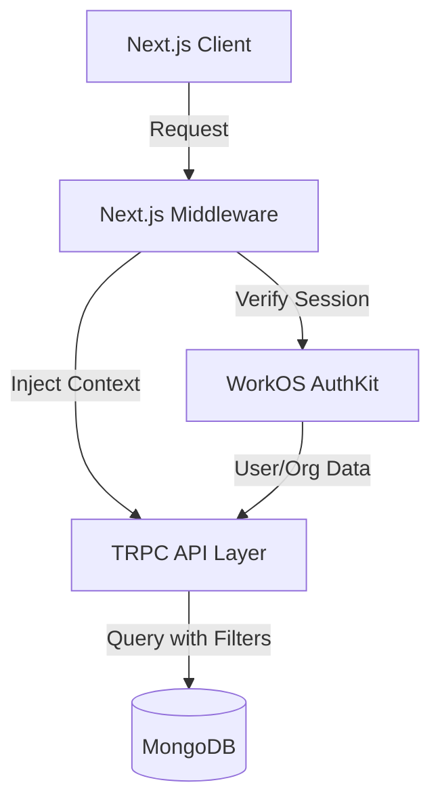
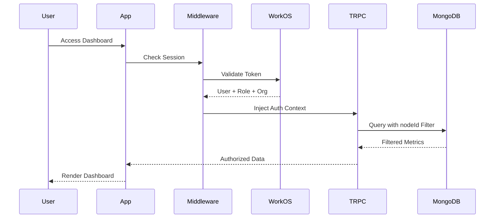

# Design Document

## Overview

This design document outlines the architecture and implementation approach for transforming the ACM2 Central metrics dashboard into a multi-tenant analytics platform with WorkOS authentication and role-based access control.

The system will maintain the existing Next.js 15, MongoDB, TRPC, and shadcn/ui foundation while adding:
- WorkOS AuthKit for authentication and session management
- Role-based authorization (Administrator vs End User)
- Multi-tenant data isolation at the database and API layers
- Context-aware UI that adapts based on user role and organization
- Secure node/company switching for administrators

## Architecture

### High-Level Architecture



### Authentication Flow




### Technology Stack

**Frontend:**
- Next.js 15 (App Router with Server Components)
- React 19
- shadcn/ui components
- Tailwind CSS
- Recharts for data visualization
- TRPC React Query for data fetching

**Backend:**
- Next.js API Routes
- TRPC v11 for type-safe APIs
- Mongoose for MongoDB ODM
- WorkOS AuthKit for authentication
- Zod for validation
- neverthrow for error handling

**Infrastructure:**
- MongoDB for data storage
- WorkOS for authentication and user management

## Components and Interfaces

### 1. Authentication Layer

#### WorkOS Integration

**Middleware Configuration** (`src/middleware.ts`):
```typescript
import { authkitMiddleware } from '@workos-inc/authkit-nextjs';

export default authkitMiddleware({
  middlewareAuth: {
    enabled: true,
    unauthenticatedPaths: ['/api/health'],
  },
});

export const config = {
  matcher: ['/((?!_next/static|_next/image|favicon.ico).*)'],
};
```

**Session Management**:
- Use `withAuth()` in server components to retrieve user session
- Use `useAuth()` hook in client components for reactive session state
- Automatic session refresh handled by AuthKit middleware
- Secure cookie-based session storage

#### User Role Detection

**Role Mapping Strategy**:

- WorkOS organizations map to nodes/companies in our system
- User roles are determined by WorkOS role metadata
- Administrator role: users with `admin` role in WorkOS
- End User role: all other authenticated users
- Organization ID from WorkOS maps to `nodeId` in metrics

**User Context Interface**:
```typescript
interface UserContext {
  userId: string;
  email: string;
  firstName?: string;
  lastName?: string;
  role: 'admin' | 'user';
  organizationId: string; // Maps to nodeId
  organizationName: string;
}
```

### 2. TRPC Layer Enhancement

#### Context Creation

**Enhanced TRPC Context** (`src/server/api/trpc.ts`):
```typescript
import { withAuth } from '@workos-inc/authkit-nextjs';
import { TRPCError } from '@trpc/server';

export const createTRPCContext = async (opts: { headers: Headers }) => {
  const { user, accessToken } = await withAuth();
  
  if (!user) {
    return { ...opts, user: null, userContext: null };
  }

  // Extract role from WorkOS user metadata
  const role = user.role === 'admin' ? 'admin' : 'user';
  
  const userContext: UserContext = {
    userId: user.id,
    email: user.email,
    firstName: user.firstName,
    lastName: user.lastName,
    role,
    organizationId: user.organizationId,
  };

  return {
    ...opts,
    user,
    userContext,
    accessToken,
  };
};
```

#### Authorization Procedures

**Protected Procedures**:
```typescript
// Authenticated procedure - requires any logged-in user
export const protectedProcedure = publicProcedure.use(async ({ ctx, next }) => {
  if (!ctx.userContext) {
    throw new TRPCError({
      code: 'UNAUTHORIZED',
      message: 'You must be logged in to access this resource',
    });
  }
  return next({ ctx: { ...ctx, userContext: ctx.userContext } });
});

// Admin-only procedure
export const adminProcedure = protectedProcedure.use(async ({ ctx, next }) => {
  if (ctx.userContext.role !== 'admin') {
    throw new TRPCError({
      code: 'FORBIDDEN',
      message: 'You must be an administrator to access this resource',
    });
  }
  return next({ ctx });
});
```

### 3. Data Access Layer

#### Enhanced Metrics Model

**Node Association**:

- Existing `nodeId` field serves as the organization identifier
- Add compound indexes for performance: `{ nodeId: 1, timestamp: -1 }`
- Add index on nodeId alone: `{ nodeId: 1 }`

**Node/Company Model** (`src/models/node.ts`):
```typescript
interface INode {
  nodeId: string;
  name: string;
  workosOrganizationId: string;
  createdAt: Date;
  updatedAt: Date;
  isActive: boolean;
}
```

#### Metrics Router Enhancement

**Input Schemas**:
```typescript
import { z } from 'zod';

const metricsQuerySchema = z.object({
  nodeId: z.string().optional(), // Admin can specify, user gets auto-filtered
  startDate: z.date().optional(),
  endDate: z.date().optional(),
  limit: z.number().min(1).max(1000).default(100),
});

const nodeListSchema = z.object({
  includeInactive: z.boolean().default(false),
});
```

**Metrics Procedures**:
```typescript
export const metricsRouter = createTRPCRouter({
  // Get metrics with authorization
  get: protectedProcedure
    .input(metricsQuerySchema)
    .query(async ({ ctx, input }) => {
      await connectDB();
      
      // Build query filter
      const filter: any = {};
      
      // End users can only see their own node
      if (ctx.userContext.role === 'user') {
        filter.nodeId = ctx.userContext.organizationId;
      } else if (input.nodeId) {
        // Admin specified a node
        filter.nodeId = input.nodeId;
      }
      // Admin without nodeId = all nodes
      
      // Add date filters
      if (input.startDate || input.endDate) {
        filter.timestamp = {};
        if (input.startDate) filter.timestamp.$gte = input.startDate;
        if (input.endDate) filter.timestamp.$lte = input.endDate;
      }
      
      const metrics = await RAGMetric.find(filter)
        .sort({ timestamp: -1 })
        .limit(input.limit)
        .lean()
        .exec();
      
      return metrics;
    }),

  // Get aggregated stats (admin can see all, users see their node)
  getStats: protectedProcedure
    .input(metricsQuerySchema)
    .query(async ({ ctx, input }) => {
      await connectDB();
      
      const matchStage: any = {};
      
      if (ctx.userContext.role === 'user') {
        matchStage.nodeId = ctx.userContext.organizationId;
      } else if (input.nodeId) {
        matchStage.nodeId = input.nodeId;
      }
      
      if (input.startDate || input.endDate) {
        matchStage.timestamp = {};
        if (input.startDate) matchStage.timestamp.$gte = input.startDate;
        if (input.endDate) matchStage.timestamp.$lte = input.endDate;
      }
      
      const stats = await RAGMetric.aggregate([
        { $match: matchStage },
        {
          $group: {
            _id: null,
            avgResponseTime: { $avg: '$performance_metrics.average_response_time_ms' },
            totalQueries: { $sum: '$usage_metrics.processed_queries.total' },
            avgUsers: { $avg: '$usage_metrics.unique_users.daily' },
            // ... more aggregations
          },
        },
      ]);
      
      return stats[0] || null;
    }),

  // List all nodes (admin only)
  listNodes: adminProcedure
    .input(nodeListSchema)
    .query(async ({ input }) => {
      await connectDB();
      
      const filter = input.includeInactive ? {} : { isActive: true };
      const nodes = await Node.find(filter).sort({ name: 1 }).lean().exec();
      
      return nodes;
    }),

  // Get node details with latest metrics
  getNodeSummary: adminProcedure
    .input(z.object({ nodeId: z.string() }))
    .query(async ({ input }) => {
      await connectDB();
      
      const node = await Node.findOne({ nodeId: input.nodeId }).lean().exec();
      const latestMetric = await RAGMetric.findOne({ nodeId: input.nodeId })
        .sort({ timestamp: -1 })
        .lean()
        .exec();
      
      const metricsCount = await RAGMetric.countDocuments({ nodeId: input.nodeId });
      
      return {
        node,
        latestMetric,
        metricsCount,
      };
    }),
});
```

### 4. UI Components

#### Node Selector Component (Admin Only)

**Component Structure** (`src/components/node-selector.tsx`):

```typescript
'use client';

import { useRouter, useSearchParams } from 'next/navigation';
import { api } from '@/trpc/react';
import {
  Select,
  SelectContent,
  SelectItem,
  SelectTrigger,
  SelectValue,
} from '@/components/ui/select';

export function NodeSelector() {
  const router = useRouter();
  const searchParams = useSearchParams();
  const currentNodeId = searchParams.get('nodeId') || 'all';
  
  const { data: nodes, isLoading } = api.metrics.listNodes.useQuery({
    includeInactive: false,
  });
  
  const handleNodeChange = (nodeId: string) => {
    const params = new URLSearchParams(searchParams);
    if (nodeId === 'all') {
      params.delete('nodeId');
    } else {
      params.set('nodeId', nodeId);
    }
    router.push(`?${params.toString()}`);
  };
  
  if (isLoading) return <div>Loading nodes...</div>;
  
  return (
    <Select value={currentNodeId} onValueChange={handleNodeChange}>
      <SelectTrigger className="w-[200px]">
        <SelectValue placeholder="Select node" />
      </SelectTrigger>
      <SelectContent>
        <SelectItem value="all">All Nodes</SelectItem>
        {nodes?.map((node) => (
          <SelectItem key={node.nodeId} value={node.nodeId}>
            {node.name}
          </SelectItem>
        ))}
      </SelectContent>
    </Select>
  );
}
```

#### Enhanced App Layout

**Role-Aware Layout** (`src/app/_components/app-layout.tsx`):
```typescript
'use client';

import { useAuth } from '@workos-inc/authkit-nextjs/components';
import { NodeSelector } from '@/components/node-selector';

export function AppLayout({ children }: { children: ReactNode }) {
  const { user, loading } = useAuth();
  
  if (loading) return <LoadingScreen />;
  if (!user) return <UnauthenticatedView />;
  
  const isAdmin = user.role === 'admin';
  
  return (
    <div className="flex h-screen">
      <Sidebar />
      <div className="flex-1 flex flex-col">
        <Header>
          {isAdmin ? (
            <NodeSelector />
          ) : (
            <div className="text-sm text-muted-foreground">
              {user.organization?.id}
            </div>
          )}
          <UserMenu user={user} isAdmin={isAdmin} />
        </Header>
        <main className="flex-1 overflow-y-auto">
          {children}
        </main>
      </div>
    </div>
  );
}
```

#### Enhanced Metrics Dashboard

**Context-Aware Data Fetching**:
```typescript
'use client';

import { useSearchParams } from 'next/navigation';
import { useAuth } from '@workos-inc/authkit-nextjs/components';
import { api } from '@/trpc/react';

export function MetricsDashboard() {
  const { user } = useAuth();
  const searchParams = useSearchParams();
  
  // Admin can select node via URL, users always use their org
  const nodeId = user?.role === 'admin' 
    ? searchParams.get('nodeId') || undefined
    : user?.organizationId;
  
  const { data, isLoading, error } = api.metrics.get.useQuery({
    nodeId,
    startDate: getStartDate(), // From date range selector
    endDate: getEndDate(),
  });
  
  const { data: stats } = api.metrics.getStats.useQuery({ nodeId });
  
  if (isLoading) return <LoadingState />;
  if (error) return <ErrorState error={error} />;
  
  return (
    <div className="p-6">
      <StatsRow stats={stats} />
      <ChartsGrid metrics={data} />
    </div>
  );
}
```

### 5. Date Range Filtering

**Date Range Selector Component**:
```typescript
'use client';

import { useState } from 'react';
import { Calendar } from '@/components/ui/calendar';
import { Popover, PopoverContent, PopoverTrigger } from '@/components/ui/popover';
import { Button } from '@/components/ui/button';

type DateRange = {
  from: Date;
  to: Date;
};

const presets = [
  { label: 'Last 7 days', days: 7 },
  { label: 'Last 30 days', days: 30 },
  { label: 'Last 90 days', days: 90 },
];

export function DateRangeSelector({ 
  value, 
  onChange 
}: { 
  value: DateRange; 
  onChange: (range: DateRange) => void;
}) {
  return (
    <div className="flex gap-2">
      {presets.map((preset) => (
        <Button
          key={preset.days}
          variant="outline"
          size="sm"
          onClick={() => {
            const to = new Date();
            const from = new Date();
            from.setDate(from.getDate() - preset.days);
            onChange({ from, to });
          }}
        >
          {preset.label}
        </Button>
      ))}
      <Popover>
        <PopoverTrigger asChild>
          <Button variant="outline">Custom Range</Button>
        </PopoverTrigger>
        <PopoverContent>
          <Calendar
            mode="range"
            selected={{ from: value.from, to: value.to }}
            onSelect={(range) => range && onChange(range)}
          />
        </PopoverContent>
      </Popover>
    </div>
  );
}
```

### 6. Audit Logging

**Audit Log Model** (`src/models/audit-log.ts`):

```typescript
interface IAuditLog {
  userId: string;
  userEmail: string;
  action: 'auth' | 'node_switch' | 'metrics_access' | 'export';
  nodeId?: string;
  metadata: Record<string, any>;
  timestamp: Date;
  ipAddress?: string;
  userAgent?: string;
}

const auditLogSchema = new mongoose.Schema<IAuditLog>({
  userId: { type: String, required: true, index: true },
  userEmail: { type: String, required: true },
  action: { type: String, required: true, index: true },
  nodeId: { type: String, index: true },
  metadata: { type: mongoose.Schema.Types.Mixed },
  timestamp: { type: Date, required: true, default: Date.now, index: true },
  ipAddress: String,
  userAgent: String,
});

// TTL index for 90-day retention
auditLogSchema.index({ timestamp: 1 }, { expireAfterSeconds: 7776000 });
```

**Audit Logging Utility**:
```typescript
import { AuditLog } from '@/models/audit-log';

export async function logAudit(params: {
  userId: string;
  userEmail: string;
  action: IAuditLog['action'];
  nodeId?: string;
  metadata?: Record<string, any>;
  request?: Request;
}) {
  try {
    await AuditLog.create({
      userId: params.userId,
      userEmail: params.userEmail,
      action: params.action,
      nodeId: params.nodeId,
      metadata: params.metadata || {},
      timestamp: new Date(),
      ipAddress: params.request?.headers.get('x-forwarded-for') || undefined,
      userAgent: params.request?.headers.get('user-agent') || undefined,
    });
  } catch (error) {
    console.error('Failed to log audit event:', error);
    // Don't throw - audit logging should not break the main flow
  }
}
```

## Data Models

### Enhanced RAGMetric Schema

**Index Additions**:
```typescript
// Add to existing schema
ragMetricSchema.index({ nodeId: 1 });
ragMetricSchema.index({ nodeId: 1, timestamp: -1 });
ragMetricSchema.index({ timestamp: -1 });
```

### Node Schema

```typescript
const nodeSchema = new mongoose.Schema<INode>({
  nodeId: { type: String, required: true, unique: true, index: true },
  name: { type: String, required: true },
  workosOrganizationId: { type: String, required: true, unique: true },
  createdAt: { type: Date, default: Date.now },
  updatedAt: { type: Date, default: Date.now },
  isActive: { type: Boolean, default: true },
});

export const Node = mongoose.models.Node || mongoose.model('Node', nodeSchema);
```

### User Preferences Schema

```typescript
interface IUserPreferences {
  userId: string;
  chartVisibility: Record<string, boolean>;
  defaultDateRange: number; // days
  defaultNodeId?: string; // For admins
  theme: 'light' | 'dark' | 'system';
}

const userPreferencesSchema = new mongoose.Schema<IUserPreferences>({
  userId: { type: String, required: true, unique: true, index: true },
  chartVisibility: { type: Map, of: Boolean, default: {} },
  defaultDateRange: { type: Number, default: 30 },
  defaultNodeId: String,
  theme: { type: String, enum: ['light', 'dark', 'system'], default: 'system' },
});
```

## Error Handling

### Error Types

**Custom Error Classes**:
```typescript
export class UnauthorizedError extends Error {
  constructor(message = 'You must be logged in') {
    super(message);
    this.name = 'UnauthorizedError';
  }
}

export class ForbiddenError extends Error {
  constructor(message = 'You do not have permission') {
    super(message);
    this.name = 'ForbiddenError';
  }
}

export class NodeNotFoundError extends Error {
  constructor(nodeId: string) {
    super(`Node ${nodeId} not found`);
    this.name = 'NodeNotFoundError';
  }
}
```

### Error Handling in TRPC

**Error Formatter**:
```typescript
errorFormatter({ shape, error }) {
  return {
    ...shape,
    data: {
      ...shape.data,
      zodError: error.cause instanceof ZodError ? error.cause.flatten() : null,
      userMessage: getUserFriendlyMessage(error),
    },
  };
}

function getUserFriendlyMessage(error: any): string {
  if (error.code === 'UNAUTHORIZED') {
    return 'Please sign in to continue';
  }
  if (error.code === 'FORBIDDEN') {
    return 'You do not have permission to access this resource';
  }
  if (error.code === 'NOT_FOUND') {
    return 'The requested data could not be found';
  }
  return 'An unexpected error occurred. Please try again.';
}
```

### Client-Side Error Handling

**Error Boundary Component**:
```typescript
'use client';

import { Component, type ReactNode } from 'react';
import { Button } from '@/components/ui/button';
import { Card } from '@/components/ui/card';

export class ErrorBoundary extends Component<
  { children: ReactNode },
  { hasError: boolean; error?: Error }
> {
  constructor(props: any) {
    super(props);
    this.state = { hasError: false };
  }

  static getDerivedStateFromError(error: Error) {
    return { hasError: true, error };
  }

  render() {
    if (this.state.hasError) {
      return (
        <Card className="p-6 m-6">
          <h2 className="text-lg font-semibold mb-2">Something went wrong</h2>
          <p className="text-muted-foreground mb-4">
            {this.state.error?.message || 'An unexpected error occurred'}
          </p>
          <Button onClick={() => window.location.reload()}>
            Reload Page
          </Button>
        </Card>
      );
    }

    return this.props.children;
  }
}
```

## Testing Strategy

### Unit Tests

**TRPC Procedures**:
- Test authorization middleware with different user roles
- Test data filtering logic for admin vs user
- Test input validation with Zod schemas
- Test error handling for various scenarios

**Components**:
- Test NodeSelector with mock data
- Test role-based rendering in AppLayout
- Test date range selector functionality
- Test chart visibility controls

### Integration Tests

**Authentication Flow**:
- Test WorkOS callback handling
- Test session creation and persistence
- Test session refresh
- Test logout flow

**Data Access**:
- Test metrics queries with different filters
- Test aggregation pipelines
- Test multi-tenant data isolation
- Test node switching for admins

### End-to-End Tests

**User Journeys**:

1. **End User Flow**:
   - Sign in via WorkOS
   - View dashboard with own organization's data
   - Filter by date range
   - Export data
   - Sign out

2. **Administrator Flow**:
   - Sign in via WorkOS
   - View all nodes dashboard
   - Switch to specific node
   - Compare metrics across nodes
   - Access node management
   - Sign out

3. **Security Tests**:
   - Attempt to access other organization's data via URL manipulation
   - Attempt to access admin endpoints as regular user
   - Verify session expiration handling
   - Test CSRF protection

## Performance Optimization

### Database Optimization

**Indexes**:
```typescript
// Metrics collection
db.ragmetrics.createIndex({ nodeId: 1, timestamp: -1 });
db.ragmetrics.createIndex({ nodeId: 1 });
db.ragmetrics.createIndex({ timestamp: -1 });

// Nodes collection
db.nodes.createIndex({ nodeId: 1 }, { unique: true });
db.nodes.createIndex({ workosOrganizationId: 1 }, { unique: true });

// Audit logs collection
db.auditlogs.createIndex({ userId: 1, timestamp: -1 });
db.auditlogs.createIndex({ timestamp: 1 }, { expireAfterSeconds: 7776000 });
```

**Query Optimization**:
- Use `.lean()` for read-only queries to skip Mongoose hydration
- Use aggregation pipelines for complex statistics
- Implement pagination for large result sets
- Use projection to limit returned fields

### Caching Strategy

**React Query Configuration**:
```typescript
export const queryClientConfig = {
  defaultOptions: {
    queries: {
      staleTime: 30_000, // 30 seconds
      cacheTime: 5 * 60_000, // 5 minutes
      refetchOnWindowFocus: false,
      retry: 1,
    },
  },
};
```

**Server-Side Caching**:
- Use Next.js data cache for prefetched queries
- Implement Redis caching for frequently accessed aggregations (future enhancement)

### Code Splitting

- Lazy load chart components
- Split admin-only components into separate bundles
- Use dynamic imports for heavy dependencies

## Security Considerations

### Authentication Security

1. **Session Management**:
   - Secure, HTTP-only cookies for session tokens
   - Automatic token refresh before expiration
   - Secure session termination on logout

2. **CSRF Protection**:
   - Built-in Next.js CSRF protection
   - SameSite cookie attribute

3. **XSS Prevention**:
   - React's built-in XSS protection
   - Content Security Policy headers
   - Sanitize user-generated content

### Authorization Security

1. **Multi-Tenant Isolation**:
   - Server-side enforcement of nodeId filters
   - No client-side filtering for security
   - Validate all inputs with Zod schemas

2. **Role-Based Access**:
   - Verify roles on every request
   - Use TRPC middleware for consistent enforcement
   - Audit all privileged actions

3. **Data Exposure Prevention**:
   - Never expose other organizations in autocomplete
   - Limit error messages to prevent information leakage
   - Use generic error messages for unauthorized access

### API Security

1. **Rate Limiting**:
   - Implement rate limiting per user/IP (future enhancement)
   - Throttle expensive aggregation queries

2. **Input Validation**:
   - Validate all inputs with Zod
   - Sanitize database queries
   - Prevent NoSQL injection

## Deployment Considerations

### Environment Variables

**Required Variables**:
```bash
# Database
MONGODB_URI=mongodb://...

# WorkOS
WORKOS_API_KEY=sk_...
WORKOS_CLIENT_ID=client_...
WORKOS_COOKIE_PASSWORD=... # 32+ character secret
NEXT_PUBLIC_WORKOS_REDIRECT_URI=https://yourdomain.com/callback

# Application
NODE_ENV=production
NEXT_PUBLIC_APP_URL=https://yourdomain.com
```

### Database Migrations

**Initial Setup Script**:
```typescript
// scripts/setup-multi-tenant.ts
import { connectDB } from '@/lib/db';
import { RAGMetric, Node } from '@/models';

async function setupMultiTenant() {
  await connectDB();
  
  // Create indexes
  await RAGMetric.collection.createIndex({ nodeId: 1, timestamp: -1 });
  await RAGMetric.collection.createIndex({ nodeId: 1 });
  
  // Migrate existing data if needed
  const existingMetrics = await RAGMetric.find({ nodeId: { $exists: false } });
  if (existingMetrics.length > 0) {
    console.log(`Found ${existingMetrics.length} metrics without nodeId`);
    // Handle migration...
  }
  
  console.log('Multi-tenant setup complete');
}
```

### Monitoring and Observability

1. **Logging**:
   - Structured logging with context
   - Log all authentication events
   - Log authorization failures
   - Log slow queries

2. **Metrics**:
   - Track API response times
   - Monitor database query performance
   - Track authentication success/failure rates
   - Monitor session refresh rates

3. **Alerts**:
   - Alert on authentication failures spike
   - Alert on slow database queries
   - Alert on high error rates

## Migration Path

### Phase 1: Authentication Setup
1. Configure WorkOS environment
2. Implement middleware and session handling
3. Update layout with authentication
4. Test authentication flow

### Phase 2: Authorization Layer
1. Enhance TRPC context with user info
2. Create protected procedures
3. Update existing procedures with authorization
4. Test role-based access

### Phase 3: Multi-Tenant Data
1. Create Node model and seed data
2. Add database indexes
3. Update metrics queries with filters
4. Test data isolation

### Phase 4: UI Enhancements
1. Implement NodeSelector component
2. Update AppLayout for role-aware rendering
3. Add date range filtering
4. Implement audit logging

### Phase 5: Testing and Refinement
1. Write comprehensive tests
2. Performance testing and optimization
3. Security audit
4. Documentation

## Future Enhancements

1. **Advanced Analytics**:
   - Comparative analysis across nodes
   - Trend detection and forecasting
   - Anomaly detection

2. **Customization**:
   - Custom dashboard layouts
   - Saved views and filters
   - Scheduled reports

3. **Collaboration**:
   - Share dashboards with team members
   - Comments and annotations
   - Export to various formats

4. **Real-time Updates**:
   - WebSocket integration for live data
   - Real-time alerts and notifications

5. **Mobile Support**:
   - Progressive Web App
   - Mobile-optimized views
   - Push notifications
